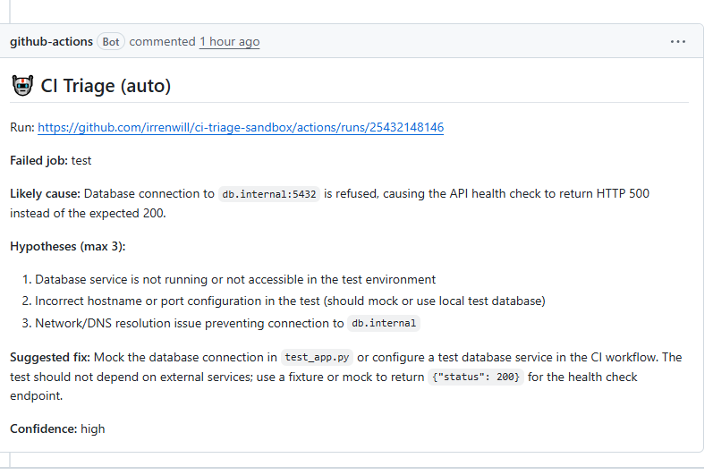

# CI Triage Bot

**AI-powered CI failure analysis that posts actionable triage comments on your PRs.**

## What it looks like

When your CI fails on a PR, you get a structured analysis like this:



> [See this comment in context →](https://github.com/irrenwill/ci-triage-sandbox/pull/1)

## Why

CI fails. You click into the run, scroll through hundreds of log lines, squint at the error, and figure out what went wrong. Every time.

CI Triage Bot does the squinting for you. When a workflow fails on a PR, it reads the failed job's logs, sends them to an LLM, and posts a structured triage comment — root cause, hypotheses, and a suggested fix — directly on the PR.

**BYOK (Bring Your Own Key)** — you provide your own [OpenRouter API key](https://openrouter.ai/keys). No account with us, no fees from us, no data passes through us. Your key talks directly to OpenRouter from your GitHub Actions runner. Median cost per triage: ~$0.002.

## Quick Start

**1. Get an [OpenRouter API key](https://openrouter.ai/keys)** and add it as a repository secret named `OPENROUTER_API_KEY`:
   - Go to your repo → **Settings** → **Secrets and variables** → **Actions** → **New repository secret**
   - Name: `OPENROUTER_API_KEY`, Value: your key from [openrouter.ai/keys](https://openrouter.ai/keys)

**2. Create `.github/workflows/ci-triage.yml`** in your repo:

```yaml
name: CI Triage
on:
  workflow_run:
    workflows: ["CI"]  # <-- replace with YOUR workflow name
    types: [completed]

permissions:
  pull-requests: write
  issues: write
  actions: read
  contents: read

jobs:
  triage:
    if: >
      github.event.workflow_run.conclusion == 'failure' &&
      (github.event.workflow_run.event == 'pull_request' ||
       github.event.workflow_run.event == 'push' ||
       github.event.workflow_run.event == 'workflow_dispatch')
    runs-on: ubuntu-latest
    steps:
      - uses: irrenwill/ci-triage-bot@v1
        with:
          openrouter-key: ${{ secrets.OPENROUTER_API_KEY }}
          # model: 'google/gemini-2.5-flash'  # optional — default: claude-haiku-4.5
```

**3. Push, break CI, and watch the comment appear.**

## How It Works

```
PR push ──> CI workflow runs ──> fails
                                   │
                        workflow_run event fires
                                   │
                          CI Triage Bot runs:
                            1. Download failed job logs (gh CLI)
                            2. Trim to last N lines
                            3. Send to LLM via OpenRouter
                            4. Has PR? → comment on PR
                               No PR?  → open issue (label: ci-triage-auto)
```

## Inputs

| Input | Required | Default | Description |
|-------|----------|---------|-------------|
| `openrouter-key` | **Yes** | — | Your [OpenRouter API key](https://openrouter.ai/keys) |
| `model` | No | `anthropic/claude-haiku-4.5` | Any model available on OpenRouter |
| `max-log-lines` | No | `200` | Max log lines sent to the model |
| `max-tokens` | No | `800` | Max tokens in the model response |
| `github-token` | No | `${{ github.token }}` | Token for posting comments and reading logs |

## Output Format

The bot posts a comment with this structure:

> **Failed job:** test-unit
> **Likely cause:** Missing dependency `foo` in requirements.txt
> **Hypotheses (max 3):**
> 1. `foo` was removed from requirements.txt in this PR
> 2. Transitive dependency conflict after upgrading `bar`
> **Suggested fix:** Add `foo>=2.0` to requirements.txt
> **Confidence:** high

## Limitations & Security

- **Forked PRs**: This action uses the standard `workflow_run` event with read-only `GITHUB_TOKEN` semantics. PRs from forks may not receive triage comments due to GitHub's permission model. This is intentional — we do not use `pull_request_target` to avoid exposing secrets to untrusted code.

- **Log truncation**: Only the last N lines (default 200) of the failed log are analyzed. If your failure output appears earlier in the run, increase `max-log-lines`.

- **Multi-job workflows**: When multiple parallel jobs fail in the same workflow run, the action analyzes the consolidated log from `gh run view --log-failed`. The single comment summarizes the dominant failure pattern. Per-job analysis is tracked in [#2](../../issues/2).

- **Multiple CI workflows**: If your repo has multiple CI workflows (e.g., `test.yml` and `lint.yml`) that both fail on the same PR, each generates its own triage comment. This is by design — each workflow fails for different reasons and produces a separate analysis.

- **Re-run behavior**: Each failed workflow run posts a new PR comment. Re-running CI on the same PR will create additional comments. A sticky-comment mode (update instead of create) is tracked in [#1](../../issues/1).

- **Issue dedup**: When no PR is found, the bot searches for an existing open issue with the same workflow name and `ci-triage-auto` label. If found, it adds a comment to that issue instead of creating a new one. Close the issue to reset the cycle.

- **No write access**: This action only posts comments and creates issues. It does not commit, push, or modify any code or workflow files.

## Privacy & Data Handling

This action sends **the tail of your failed CI log** (last 200 lines by default) to [OpenRouter](https://openrouter.ai), which routes it to the configured LLM provider. Be aware:

- **CI logs may contain sensitive data** — email addresses, usernames, file paths, or environment variables that were accidentally printed. This action does not filter or redact log content before sending.
- **No source code is sent** unless it appears in the log output itself.
- **Your OpenRouter API key** is used for the API call and is never logged or stored by this action.
- **The triage response** is posted as a public comment on your PR. Ensure your repository's visibility settings align with your data sensitivity requirements.
- **Data retention** is governed by [OpenRouter's privacy policy](https://openrouter.ai/privacy) and the downstream model provider's terms.

If your CI logs may contain personal data subject to GDPR, CCPA, or similar regulations, evaluate whether sending them to a third-party API complies with your organization's data processing policies. You can reduce exposure by lowering `max-log-lines`.

## FAQ

**How much does it cost?**
Claude Haiku 4.5 via OpenRouter costs ~$0.001-0.003 per triage. A repo with 10 CI failures per day would cost roughly $0.50-1.00/month. You can check usage at [openrouter.ai/usage](https://openrouter.ai/usage).

**Can I use a different model?**
Yes. Set the `model` input to any model ID available on OpenRouter (e.g., `google/gemini-2.5-flash`, `openai/gpt-4.1-mini`). See [openrouter.ai/models](https://openrouter.ai/models) for the full list.

**Does my code get sent to OpenRouter?**
Only the **failed log output** (last 200 lines by default) is sent. Source code is not included unless it appears in the log. OpenRouter's privacy policy applies to data in transit. If this is a concern, reduce `max-log-lines` or use a model with stricter data policies.

**Why OpenRouter instead of direct Anthropic/OpenAI?**
OpenRouter gives you model flexibility with a single API key. You can switch between Claude, GPT, Gemini, or open-source models without changing your workflow. If you want direct Anthropic, you can self-host a compatible proxy — the script uses the standard OpenAI SDK client.

**Does it work with `pull_request_target`?**
Yes. The `workflow_run` trigger fires for both `pull_request` and `pull_request_target` events. The bot resolves the PR number from either.

**What if no PR is associated with the failed run?**
The bot creates a GitHub Issue with the triage analysis as the body, labeled `ci-triage-auto`. This covers push-to-main failures, `workflow_dispatch` runs, and other non-PR triggers. Requires `issues: write` permission.

**Why does re-running CI create multiple comments?**
On PRs, each failed workflow run posts a new comment — different runs may fail for different reasons (flaky test, pushed fix between runs). A sticky-comment mode is planned for PRs — track [#1](../../issues/1). For non-PR failures, the bot reuses an existing open issue (same workflow name + `ci-triage-auto` label) and adds a comment instead of creating a new issue.

**How does this handle multiple parallel job failures?**
The action downloads the consolidated failed log via `gh run view --log-failed`, which includes output from all failed jobs. The LLM analyzes this combined log and summarizes the dominant failure. If you need separate analysis per job, let us know — we're tracking interest in [#2](../../issues/2).

## Roadmap

- [ ] Sticky comment mode — update existing comment instead of creating new ones ([#1](../../issues/1))
- [ ] Per-job analysis for multi-job workflows ([#2](../../issues/2))
- [ ] Read-only mode for forked PRs ([#3](../../issues/3))
- [ ] Configurable comment template (custom prompt / output format)
- [ ] Slack / Discord notification option alongside PR comments
- [ ] Failure pattern memory (detect recurring failures across runs)

## Examples

See the [`examples/`](examples/) directory for complete, copy-pastable workflow files:

- [`basic-usage.yml`](examples/basic-usage.yml) — Minimal setup
- [`custom-model.yml`](examples/custom-model.yml) — Override model and token limit
- [`nightly-issue.yml`](examples/nightly-issue.yml) — Combine triage with auto-issue creation for nightly builds

## License

[MIT](LICENSE)
